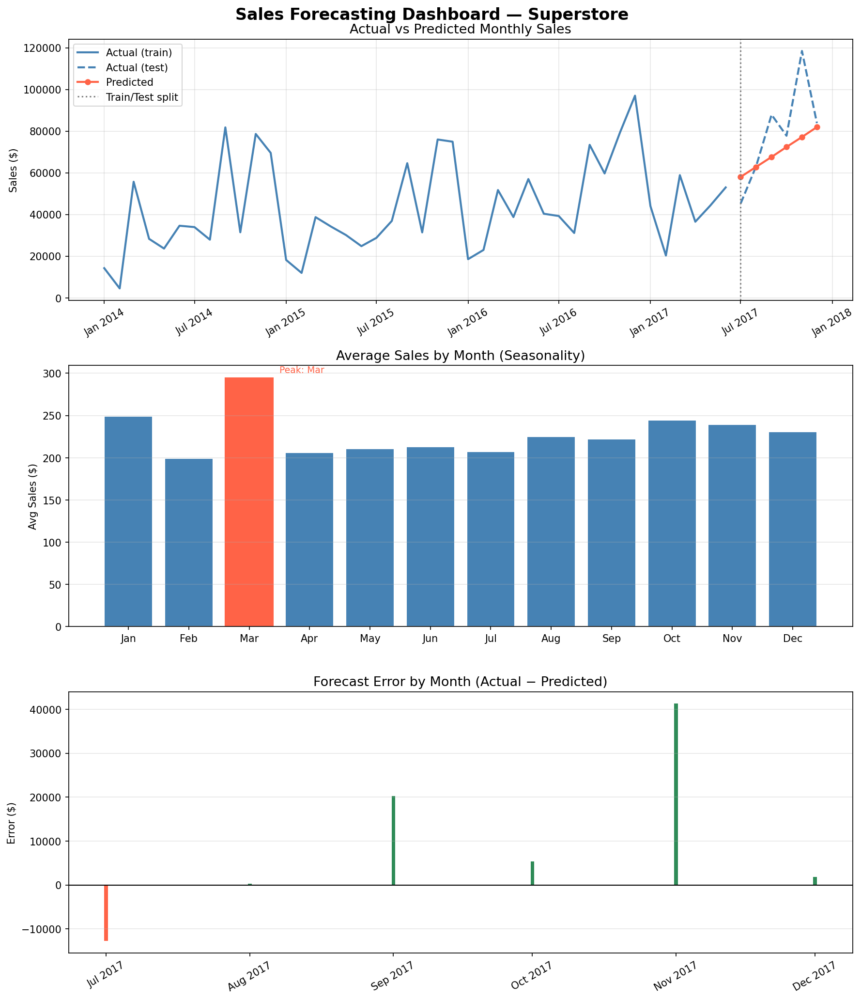
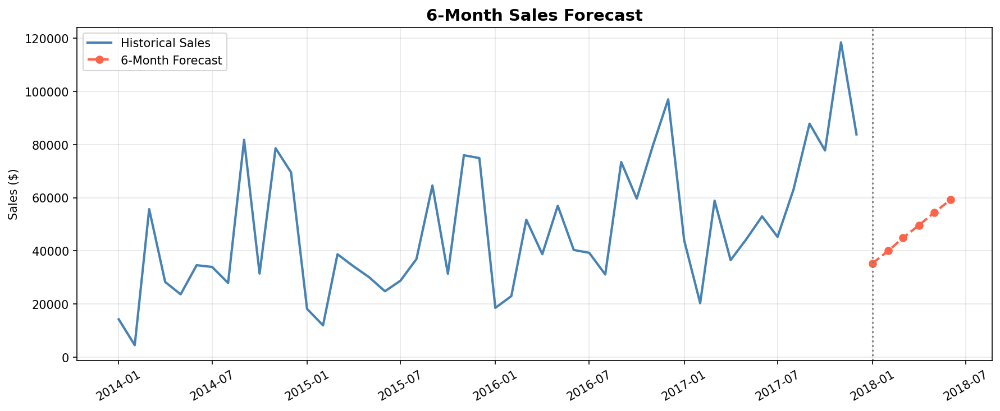

# FUTURE_ML_01 — Sales & Demand Forecasting

## 📌 Internship Task 1 | Future Interns — Machine Learning

## Overview
A machine learning project that forecasts monthly sales using the Superstore dataset.
Built with Linear Regression and time-series feature engineering.

## Features
- Monthly sales aggregation & trend analysis
- Seasonal pattern detection
- 6-month future sales forecast
- Visual dashboard with 3 charts

## Tech Stack
- Python, Pandas, NumPy
- Scikit-learn (Linear Regression)
- Matplotlib

## Results
| Metric | Value |
|--------|-------|
| MAE    |  $13,649.87 |
| RMSE   | $19,624.73 |
| MAPE   | 15.97% |

## Charts

